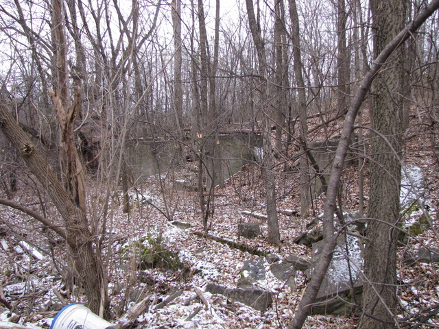
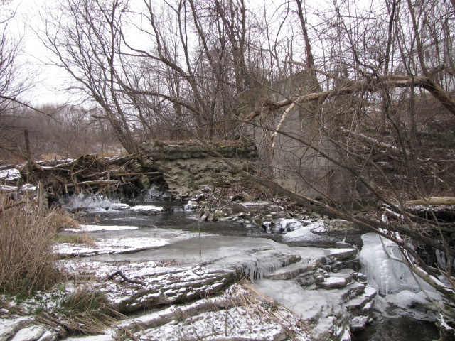
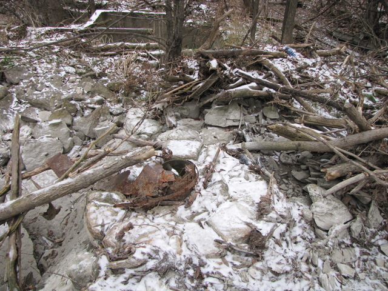

Hors des limites du territoire de l'association, dans le quartier de 
[Cardinal Creek Village](https://www.cardinalcreekvillage.org/)
est situé l'ancien moulin d'Isidore Cardinal.

En 1885, Isidore Cardinal achète une propriété de 100 acres appartenant à Honoré Cotte, tout juste au nord du chemin Montréal,
sur les rives d'un cours d'eau que l'on nomme de nos jours le ruisseau Cardinal.
Le barrage et le moulin sont déjà en place lors de l'achat par Isidore Cardinal.
Une ancienne photographie montre le moulin.
Le moulin a été opérationel jusqu'en 1957
(source: [The Caboose – Édition Mars 2005](https://cths.ca/wp-content/uploads/2017/06/The-Caboose-March-2005.pdf)).

Aujourd'hui il ne reste que des ruines du moulin et du barrage.
Ci-dessous des photographies prises à l'automne 2012.

La première photo montre ce qui reste du moulin, les murs de fondation et des structures au sol.
Une jeune forêt a poussé depuis la fermeture du moulin.

En regardant vers le ruissean à partir des ruines, nous voyons qu'une portion du barrage est toujours debout.
Dans les années 1960, c'était un lieu fréquenté par les jeunes afin de se rafraichir lors des journées chaudes de l'été.
Il était possible de plonger dans le bassin d'eau à partir du barrage.
De nos jours, le niveau du ruisseau est trop bas car il a été asséché par l'urbanisation en amont.

Vu du centre du ruisseau, en regardant vers le moulin, nous voyons un mur supportant un canal dans lequel l'eau devait s'écouler (où était-ce pour des billots de bois?).

La photographie suivante montre une structure circulaire au bas du conduit d'eau.

La photo suivant montre un réservoir où l'eau devait s'écouler après avoir quitté le conduit.

La dernière photo montre la sortie d'eau du réservoir, quasiment à la même élévation que le réservoir.

