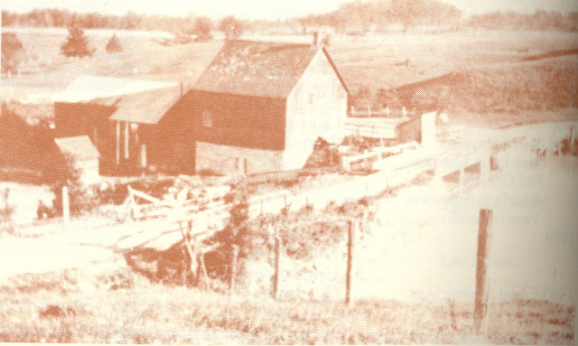
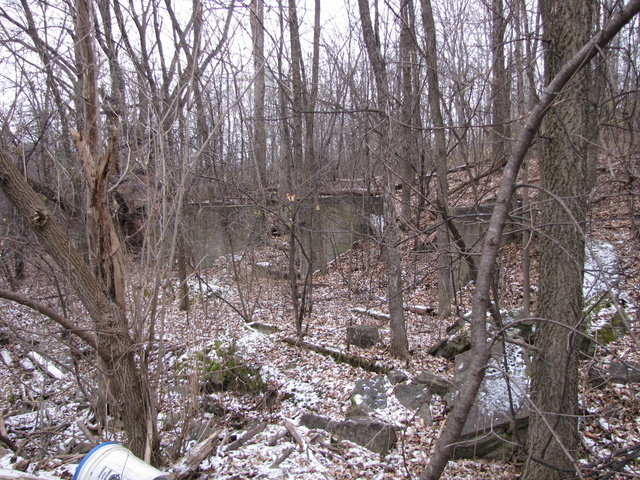
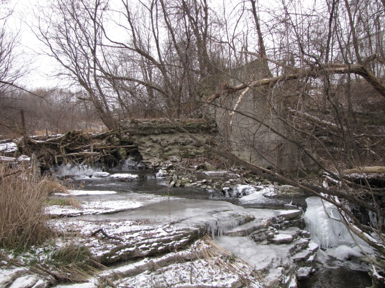
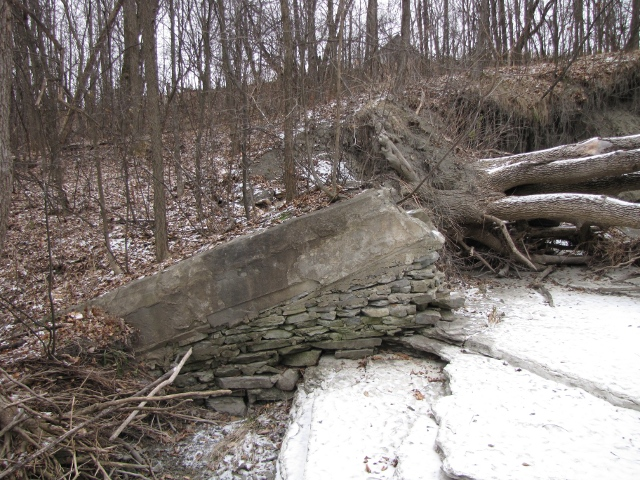
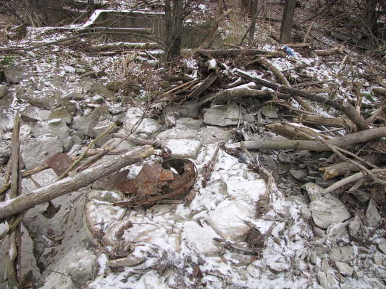
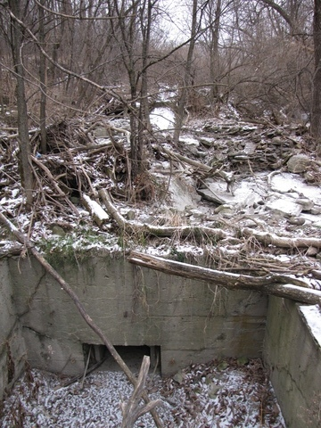
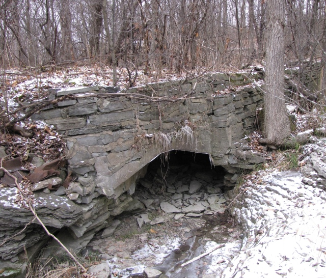

Located outside of Cardinal Creek, in a sister neighbouhood called
[Cardinal Creek Village](https://www.cardinalcreekvillage.org/), is the Mill of Isidore Cardinal.

<!--more-->
In 1885, Isidore Cardinal purchased a 100 acre property from Honoré Cotte just north of Montreal Road,
on the creek that we now know as the Cardinal Creek.
The dam and the mill were already in place when Isidore Cardinal purchased the property.
The mill can be seen on this old photograph.
The mill remained in operation until 1957 (source: [The Caboose – March 2005 edition](https://cths.ca/wp-content/uploads/2017/06/The-Caboose-March-2005.pdf)).

Today on the location of the mill stand the ruins of the dam and the mill. Below are some pictures taken in the fall of 2012.

First, what remains of the mill are foundation walls and structures on the ground. A young forest has grown since the mill was closed.

Turning the camera towards the creek, we can see that portions of the dam are still standing.
In the 1960's, this happened to be favourite location for young people to enjoy the creek on hot summer days.
People could jump from the wall of the dam into the creek.
Today the water levels are too low for that due to urbanization upstream in the watershed.

Turning the camera back towards the mill, standing in the creek, we can see a wall which appears to be channel for the water to enter into the mill (or was it for logs?)

The next picture shows a circular feature near the bottom of the water conduit.

On the next picture, we can see a reservoir where the water went after it left the conduit:

Now looking at the water outlet, downstream from the reservoir, nearly at the same elevation:

